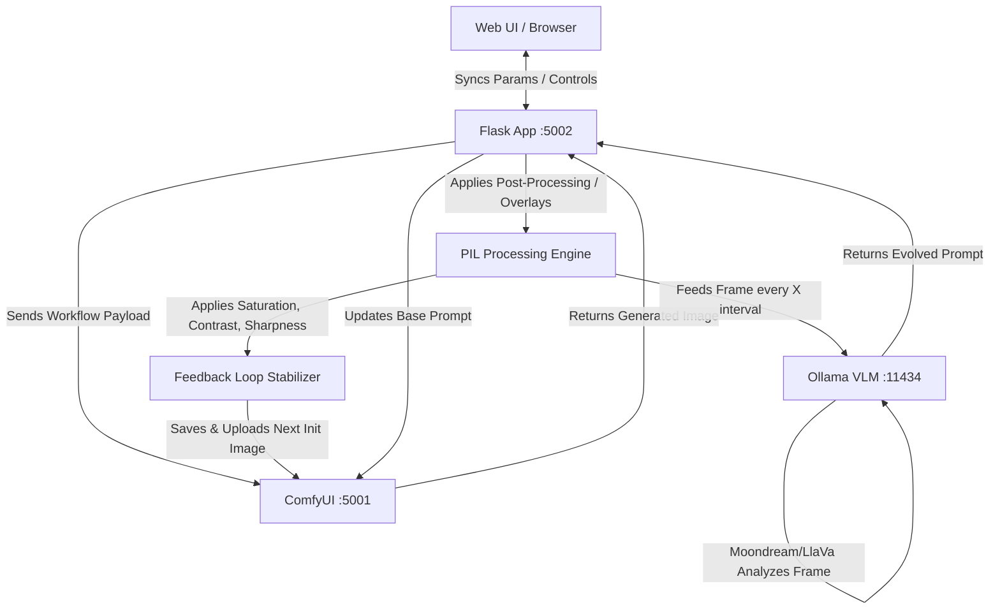

# Epoch Streamer Suite (V2) — Interactive Prompt-Morphing & Autonomous AI Director

Welcome to the **Epoch Streamer Suite (V2)**, an interactive, real-time image-to-image feedback loop system built on top of ComfyUI and local Ollama language models. 

This engine is designed to generate continuous, evolving video streams from an initial text prompt. It recursively feeds each generated frame back into ComfyUI as the starting latent image for the next frame, applying zoom/pan movements, dynamic text captions, logo overlays, and closed-loop visual feedback.

---

## 🗺️ High-Level System Architecture

Epoch Streamer connects multiple local servers to form a closed-loop creative loop:



---

## 🚀 Core V2 Features & How They Work

### 1. The Autonomous Visual Director (Closed-Loop Vision)
The Visual Director enables the stream to "see" what it is generating and redirect its own prompt based on visual feedback.

*   **How it works under the hood**:
    1. Every `X` frames (e.g. 15 or 25, customizable in the UI), the Python engine intercepts the raw generated image before any overlays (logo, text captions) are stamped on top.
    2. It triggers a memory-clearing garbage collection (`gc.collect()`) to free up memory for Ollama.
    3. It base64-encodes the image and fires it to Ollama's `/api/generate` endpoint, using a Vision Language Model (VLM) like **Moondream** or **LLaVA**.
    4. The model is asked to describe the current state in one sentence, then invent a new text prompt (under 50 words) that evolves the scene slightly (e.g. changing the camera angle, introducing a new space element, or morphing a creature).
    5. The engine parses the output and updates the running `current_prompt` dynamically.

### 2. Ollama Text Prompt Enhancer
Before you even hit the render button, you can expand a simple prompt (e.g., `"a portal in space"`) into a rich, detailed, hyper-descriptive prompt.

*   **How it works under the hood**:
    1. The frontend queries Ollama's `/api/tags` to load all your installed LLMs (`dolphin3`, `llama3.2`, `mistral`, etc.) into a dropdown.
    2. When you click **Enhance**, the Flask server instructs the selected LLM to act as a Prompt Engineer, expanding your text with atmospheric lighting, camera details, and high-fidelity modifiers.
    3. The enhanced prompt is returned and loaded into the main prompt textarea.

### 3. Feedback Loop Stabilizer (Chromatic Drift Correction)
In long-running Image-to-Image feedback streams, VAE (Variational Autoencoder) encodings slowly degrade. Without correction, images will drift toward white, lose contrast, or become muddy and desaturated after 30–50 frames.

*   **How it works under the hood**:
    Before uploading the latest frame back to ComfyUI for the next cycle, the Python script copies the frame and processes it through the `PIL.ImageEnhance` modules:
    *   **Color (Saturation) Boost**: Multiplied by `1.03` (user adjustable) to combat the natural color loss of sequential VAE decoding.
    *   **Contrast Boost**: Multiplied by `1.01` (user adjustable) to maintain deep blacks and bright highlights.
    *   **Sharpness Boost**: Multiplied by `1.10` (user adjustable) to preserve edges and prevent the sequence from turning into a blurry, soft-focus wash.

### 4. Interactive Drag-and-Drop Logo Composition
You can place a watermarked brand or logo anywhere on the generated video stream.

*   **How it works under the hood**:
    1. Upload a transparent `.png` logo. The server saves it in `/static/overlays`.
    2. In the UI, select the logo. A draggable container is dynamically scaled and overlaid on the preview frame using CSS absolute positioning.
    3. You can resize it via numerical pixel inputs, slide the opacity, and drag it anywhere on the preview frame.
    4. Clicking **Save Logo Position** posts the exact coordinate scale ratio back to the server (`logo_x`, `logo_y`, `logo_w`, `logo_h`, `logo_opacity`).
    5. During rendering, the Python engine takes these coordinates, scales them to the actual high-resolution generated frame size, and uses `PIL.Image.alpha_composite` to bake the logo into the final disk-saved frames.

### 5. Dynamic Fonts & Temporary Captioning
You can inject titles or dialogue lines into the stream on the fly.

*   **How it works under the hood**:
    1. On startup, the Python script recursively scans the `./fonts` folder for any TrueType (`.ttf`) or OpenType (`.otf`) fonts.
    2. When you type text and click **Insert Caption**, the server stores the text, selected font, and size, and arms the caption for `5 frames`.
    3. For the next 5 generated frames, `PIL.ImageDraw` renders the text onto the image with a clean, drop-shadowed boundary, automatically decrementing the countdown until it expires.

### 6. RIFE-Style Video Frame Interpolation (Via FFmpeg)
When compiling the generated frames into an MP4, the default sequence output is 5 FPS (creating a stepped, stop-motion look). V2 includes an optional RIFE-style temporal interpolator to smooth the output.

*   **How it works under the hood**:
    If **Video Interpolation** is checked when clicking **COMPILE MOVIE**, FFmpeg utilizes the `minterpolate` filter chain:
    ```bash
    ffmpeg -y -framerate 5 -i frame_%03d.png -vf "minterpolate=fps=24:mi_mode=mci:mc_mode=aobmc:me_mode=bidir:vsbmc=1" -c:v libx264 -pix_fmt yuv420p output.mp4
    ```
    This estimates motion vectors bidirectionally (`bidir`) and generates intermediate optical-flow frames, upscaling your 5 FPS sequence into a butter-smooth 24 FPS video.

### 7. Parameter Edit Protection (Manual Edit Mode)
To prevent the rapid `/status` polling loop from overwriting input fields, sliders, or dropdowns while you are editing them, the UI implements a smart sync-block:
*   Checking **"Pause Parameter Syncing (Manual edit mode)"** stops all input updates from the server.
*   The system **automatically pauses syncing** whenever the engine is `PAUSED` or `IDLE`.
*   Whenever you click **NEW PRODUCTION**, **RESUME SESSION**, or **PAUSE / UNPAUSE**, the UI automatically autosaves your edits to the server.

---

## 🛠️ Installation & Setup

### 1. Requirements & Python Packages
Ensure Python 3.10+ is installed. Install the dependencies in your environment:
```bash
pip install flask requests pillow icecream
```
Ensure you have **FFmpeg** installed on your system path (necessary for compiling movies and running interpolation).

### 2. Ollama Setup (CPU/RAM-Optimized Vision)
1. Download and install [Ollama](https://ollama.com).
2. Pull `moondream` (approx. 829MB, runs extremely fast on CPU-only 16GB RAM setups):
   ```bash
   ollama pull moondream
   ```
3. (Optional) Pull a text-enhancer model like `llama3.2:3b` or `dolphin3`:
   ```bash
   ollama pull llama3.2:3b
   ```
4. Keep Ollama running in the background.

### 3. ComfyUI Configuration
Make sure ComfyUI is running at the address specified in the script (default is `http://192.168.1.41:5001`). 
Ensure the model `dreamshaper_8.safetensors` and VAE `vae-ft-mse-840000-ema-pruned.safetensors` are loaded into your ComfyUI search path.

---

## 🎮 How to Run

1. Start the Flask application:
   ```bash
   python EpochStreamerv2.py
   ```
2. Open your browser and navigate to `http://localhost:5002`.
3. Select your text enhancer and visual director models from the dropdowns.
4. Customize your base prompt, negative prompt, LoRA strengths, zoom/pan parameters, and feedback stabilizers.
5. Click **NEW PRODUCTION** to begin generating.

---

## 🧠 CPU-Only & 16GB RAM Optimization Guide

Because local Stable Diffusion (via ComfyUI) and Vision models (via Ollama) are running concurrently on CPU, memory management is critical:

*   **Model Selection**: Always use **`moondream`** for the Visual Director instead of `LlaVa` (7B). LLaVA consumes over 4.5GB of RAM and causes severe swapping; `moondream` is less than 900MB and operates 5x faster on CPU.
*   **Garbage Collection**: Epoch Streamer calls `gc.collect()` immediately before sending images to Ollama, forcing Python to release inactive system memory blocks.
*   **Resolution Tuning**: Latent width and height have been locked to multiples of 8 (`336x512`) to prevent sizing mismatches while remaining small enough for rapid CPU generations.
